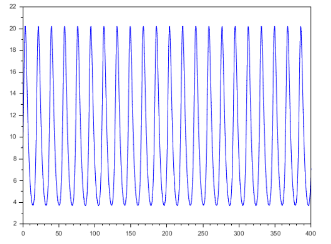
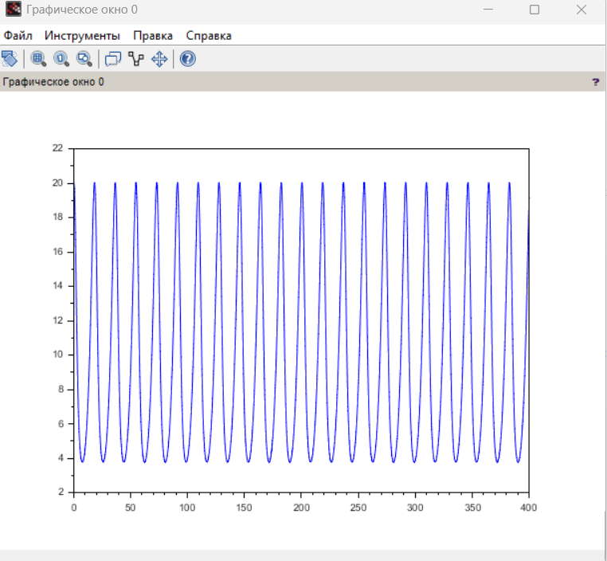

---
## Author
author:
  name: Воинов Кирилл
## Title
title: Презентация по лабораторной работе №5
date: today
date-format: "YYYY-MM-DD" 
---

# Информация

## Докладчик

:::::::::::::: {.columns align=center}
::: {.column width="70%"}

  * Воинов Кирилл Викторович
  1132236017 НФИбд-01-23

:::
::: {.column width="30%"}

:::
::::::::::::::

# Выполнение лабораторной работы

Вариант 18 Для модели «хищник-жертва»: 

## График зависимости численности хищников от численности жертв.

{width=50%}

## Графики изменения численности хищников и численности жертв.

{width=30%}

{width=30%}

## Стационарное состояние системы:

""x0=c/d"" и ""y0=a/b""

Стационарное состояние системы -- (9.37;9,373)

