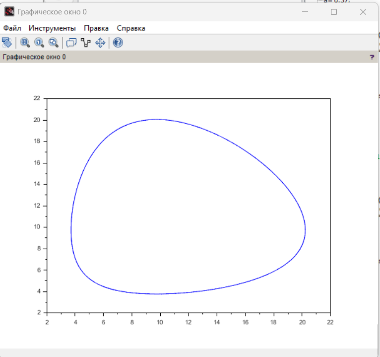

---
## Author
author:
  name: Воинов Кирилл
 
## Title
title: "Мат моделирование"
subtitle: "Лабораторная работа №5"
---

# Выполнение лабораторной работы

Вариант 18 Для модели «хищник-жертва»: 

График зависимости численности хищников от численности жертв. ([рис. @fig-001]).

{#fig-001 width=70%}

Графики изменения численности хищников ([рис. @fig-002]) и численности жертв.([рис. @fig-003])

{#fig-002 width=70%}

{#fig-003 width=70%}

Стационарное состояние системы:

""x0=c/d"" и ""y0=a/b""

Стационарное состояние системы -- (9.37;9,373)

