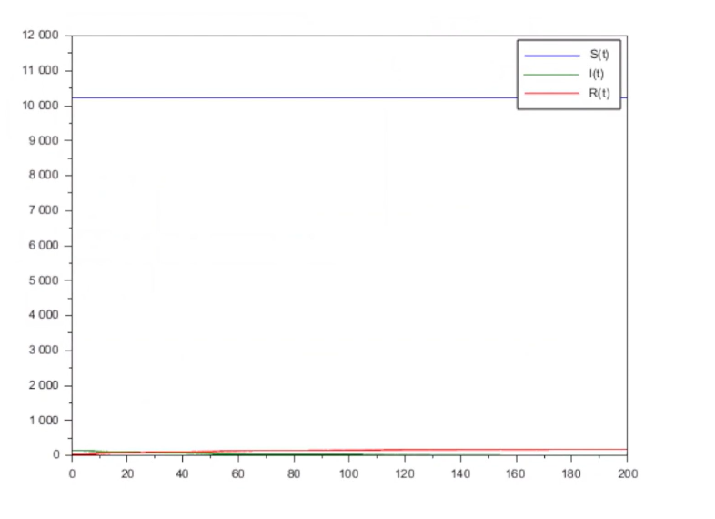
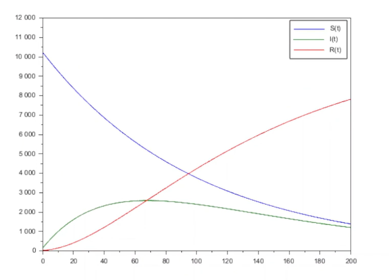

---
## Author
author:
  name: Воинов Кирилл
 
## Title
title: "Мат моделирование"
subtitle: "Лабораторная работа №5"
---

# Выполнение лабораторной работы

Вариант 18 : 

```scilab
a = 0.01; 
b = 0.02;
N = 10400;
I0 = 144; 
R0 = 28; 
S0 = N - I0 - R0;
 
// случай, когда I(0)<=I* 
function dx=syst(t, x) 
dx(1) = 0; 
dx(2) = - b*x(2); 
dx(3) = b*x(2); 
endfunction 
t0 = 0; 
x0=[S0;I0;R0]; //начальные значения  
t = [0: 0.01: 200]; 
y = ode(x0, t0, t, syst); 
plot(t, y); //построение динамики изменения числа особей в каждой из трех групп  
hl=legend(['S(t)';'I(t)';'R(t)']); 
 
// случай, когда I(0)>I* 
function dx=syst(t, x) 
dx(1) = - a*x(1); 
dx(2) = a*x(1) - b*x(2); 
dx(3) = b*x(2); 
endfunction 
t0 = 0; 
x0=[S0;I0;R0]; //начальные значения  
t = [0: 0.01: 200]; 
y = ode(x0, t0, t, syst); 
plot(t, y); //построение динамики изменения числа особей в каждой из трех групп  
hl=legend(['S(t)';'I(t)';'R(t)']); 
```

Графики изменения sir а)([рис. @fig-001]) б)([рис. @fig-002])

{#fig-001 width=70%}

{#fig-002 width=70%}


