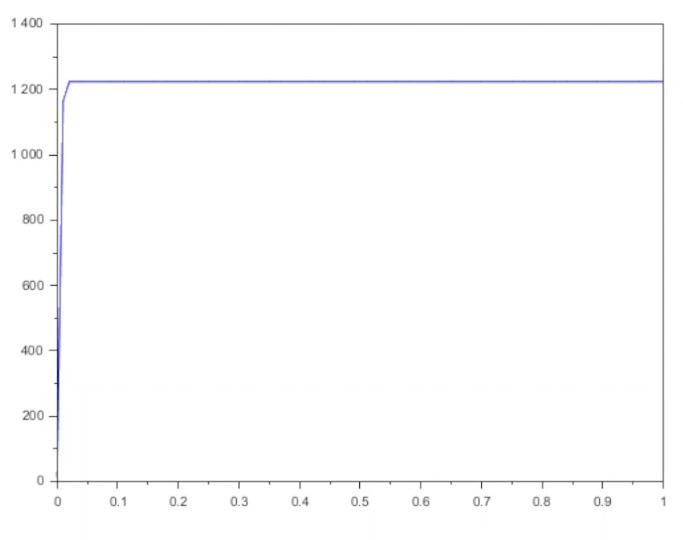

---
## Author
author:
  name: Воинов Кирилл
 
## Title
title: "Мат моделирование"
subtitle: "Лабораторная работа №7"
---
 
# Цель работы
Изучение математических моделей динамики численности аудитории (модель Мальтуса, логистическая модель, модель распространения рекламы). Построение графиков распространения рекламы для заданных коэффициентов, анализ влияния параметров модели и определение момента максимальной скорости распространения.
 
# Теоретическая часть
 
## 1. Модель Мальтуса
Модель Мальтуса [@malthus1798essay; @zhuravlev2012differ] описывает неограниченный экспоненциальный рост численности популяции (или аудитории) при отсутствии лимитирующих факторов:
 

$\frac{dn}{dt} = r n(t)$

 
где \(n(t)\) – численность в момент \(t\), \(r > 0\) – коэффициент роста.
 
**Применение:** используется для моделирования роста популяций на начальных этапах, распространения информации в замкнутой группе без насыщения, а также в демографии и экономике (простейший прогноз роста).
 
## 2. Логистическая кривая
Учитывает ограниченность ресурсов и наличие «потолка» \(N\):
 
$\frac{dn}{dt} = r n(t) \left(1 - \frac{n(t)}{N}\right)$

 
или в эквивалентной форме:
 
$\frac{dn}{dt} = \alpha n(t) \bigl(N - n(t)\bigr), \quad \alpha = \frac{r}{N}$
 
**Смысл:** описывает S-образный рост с насыщением при \(n \to N\). Используется в биологии, эпидемиологии, маркетинге (распространение товара среди фиксированной аудитории).
 
## 3. Коэффициенты $alpha_1(t)$ и $alpha_2(t)$ в модели распространения рекламы
Модель распространения рекламы часто задаётся уравнением:
 
$\frac{dn}{dt} = \bigl(\alpha_1(t) + \alpha_2(t)\, n(t)\bigr) \bigl(N - n(t)\bigr)$
 
где  
- $alpha_1(t)$ – коэффициент **внешнего воздействия** (реклама через СМИ, листовки и т.п.), не зависящий от текущего числа знающих;  
- $alpha_2(t)$ – коэффициент **внутреннего (самопроизвольного) распространения** (сарафанное радио, социальное влияние, зависящее от числа уже осведомлённых).
 
> **Влияние:**  
> - $alpha_1(t)$ увеличивает скорость распространения за счёт внешней рекламной кампании.  
> - $alpha_2(t)$ усиливает рост при больших \(n\) (эффект «каждый информирует другого»).
 
## 4. Поведение модели при $alpha_1(t) \gg \alpha_2(t)$
Если внешнее воздействие значительно превосходит внутреннее, то
 
$\frac{dn}{dt} \approx \alpha_1(t) (N - n(t))$
 
Рост определяется почти исключительно внешней рекламой. Динамика близка к экспоненциальному приближению к насыщению (скорость пропорциональна оставшейся аудитории). Самораспространение практически не влияет.
 
## 5. Поведение модели при $$alpha_1(t) \ll \alpha_2(t)$
Если внутреннее распространение доминирует, то
 
$\frac{dn}{dt} \approx \alpha_2(t) n(t) (N - n(t))$
 
Это логистическое уравнение с переменным коэффициентом. Скорость максимальна вблизи \(n \approx N/2\) (при постоянном \(\alpha_2\)). В начальной стадии рост медленный, затем резкое ускорение за счёт социальных связей, после чего замедление из-за насыщения.
 
## Постановка задачи
Даны три варианта модели распространения рекламы:
 
1. $\displaystyle \frac{dn}{dt} = \bigl(0.61 + 0.000061\, n(t)\bigr) (N - n(t))$
2. $\displaystyle \frac{dn}{dt} = \bigl(0.000073 + 0.73\, n(t)\bigr) (N - n(t))$
3. $\displaystyle \frac{dn}{dt} = \bigl(0.7t + 0.6\cos(t)\, n(t)\bigr) (N - n(t))$
 
Параметры: \(N = 1224\) (общий объём аудитории), начальное условие \(n(0) = 14\).
 
Необходимо:
- Построить графики \(n(t)\) для каждого случая.
- Для случая 2 определить момент времени \(t_{\text{max}}\), когда скорость распространения рекламы $frac{dn}{dt}$ максимальна.
 
# Выполнение лабораторной работы
 
- **Случай 1:** $alpha_1$ велико $0.61$, $alpha_2$ очень мало $(6.1\cdot10^{-5})$. Рост почти полностью определяется внешним воздействием; кривая быстро приближается к $(N)$ без S-образного изгиба ([рис. @fig-001]).
 
{#fig-001 width=70%}
 
- **Случай 2:** $alpha_1$ пренебрежимо мало $(7.3\cdot10^{-5})$, $alpha_2 = 0.73$) велико. График моментально достигает плато ([рис. @fig-002]).
 
{#fig-002 width=70%}
 
- **Случай 3:** График моментально достигает плато ([рис. @fig-003]).
 
{#fig-003 width=70%}
 
Момент максимальной скорости для случая 2 по графику: $t$ около 0.
 
# Выводы
В ходе лабораторной работы были изучены три модели роста аудитории.
 
# Список литературы {.unnumbered}
 
::: {#refs}
:::
