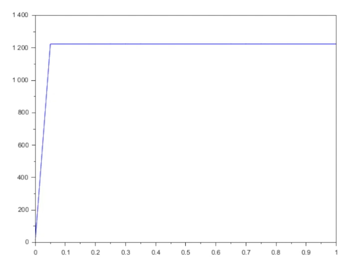

---
## Author
author:
  name: Воинов Кирилл
## Title
title: Презентация по лабораторной работе №5
date: today
date-format: "YYYY-MM-DD" 
---

# Информация

## Докладчик

:::::::::::::: {.columns align=center}
::: {.column width="70%"}

  * Воинов Кирилл Викторович
  1132236017 НФИбд-01-23

:::
::: {.column width="30%"}

:::
::::::::::::::

# Вводная часть

## Цель работы
 
- Изучить три математические модели распространения рекламы.
- Построить графики для заданных коэффициентов
- Проанализировать влияние параметров
- Найти момент максимальной скорости распространения рекламы
 
 ## Модель Мальтуса
 
**Уравнение:**
$$\frac{dn}{dt} = r\, n(t)$$
 
- \(n(t)\) – численность в момент \(t\)
- \(r>0\) – коэффициент роста
 
**Особенность:** неограниченный рост, без лимитирующих факторов
 
**Применение:** начальные этапы роста, демография, экономика
 
## Логистическая модель (рост с насыщением)
 
**Уравнение:**
$$\frac{dn}{dt} = r\, n(t)\left(1 - \frac{n(t)}{N}\right)$$
или
$$\frac{dn}{dt} = \alpha\, n(t)\bigl(N - n(t)\bigr)$$
 
- \(N\) – «потолок» (ёмкость аудитории)
- **Форма:** S-образная кривая, замедление при \(n \to N\)
 
**Применение:** биология, эпидемиология, маркетинг
 
---
 
## Модель распространения рекламы
 
$$\frac{dn}{dt} = \bigl(\alpha_1(t) + \alpha_2(t)\, n(t)\bigr)\bigl(N - n(t)\bigr)$$
 
- \(\alpha_1(t)\) – **внешнее воздействие** (СМИ, листовки) – не зависит от \(n\)
- \(\alpha_2(t)\) – **внутреннее распространение** («сарафанное радио») – зависит от числа знающих
 
**Влияние:**
- \(\alpha_1\) увеличивает скорость за счёт внешней рекламы
- \(\alpha_2\) усиливает рост при больших \(n\) (каждый информирует другого)

# Выполнение лабораторной работы

## Постановка задачи
 
**Общие параметры:**

\(N = 1224\) (объём аудитории), \(n(0) = 14\)
 
**Три варианта модели:**
 
1. \(\displaystyle \frac{dn}{dt} = \bigl(0.61 + 0.000061\, n\bigr)(N - n)\)
2. \(\displaystyle \frac{dn}{dt} = \bigl(0.000073 + 0.73\, n\bigr)(N - n)\)
3. \(\displaystyle \frac{dn}{dt} = \bigl(0.7t + 0.6\cos(t)\, n\bigr)(N - n)\)
 
**Задачи:**
- Построить графики \(n(t)\)
 
## Случай 1
 
$$\alpha_1 = 0.61 \ (\text{велико}), \quad \alpha_2 = 6.1\cdot10^{-5} \ (\text{очень мало})$$
 
- Рост почти полностью определяется внешним воздействием
- Кривая быстро приближается к \(N\) **без S-образного изгиба**
 
**График:**  

## Случай 2
 
$$\alpha_1 = 7.3\cdot10^{-5} \ (\text{пренебрежимо мало}), \quad \alpha_2 = 0.73\ \text{велико}$$
 
- График моментально достигает плато
- **Момент максимальной скорости** (по графику): \(t \approx 0\)
 

## Случай 3
 
$$\alpha_1(t) = 0.7t, \quad \alpha_2(t) = 0.6\cos(t)$$
 
- График моментально достигает плато
 

 
# Выводы

## Результаты

- Изучены три модели динамики аудитории:
  - Модель Мальтуса (неограниченный рост)
  - Логистическая модель (S-образный рост с насыщением)
  - Рекламная модель с двумя каналами воздействия
- Для заданных коэффициентов построены графики
