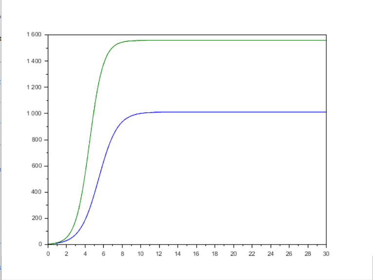
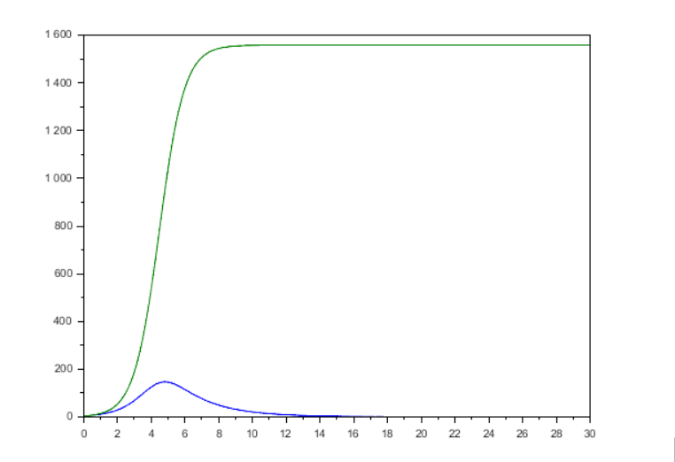

---
## Author
author:
  name: Воинов Кирилл
 
## Title
title: "Мат моделирование"
subtitle: "Лабораторная работа №8"
---

# Выполнение лабораторной работы

Вариант 18 : 

1)
```scilab
p_cr = 11.4; //критическая стоимость продукта 
tau1 = 14; //длительность производственного цикла фирмы 1 
p1 = 6.6; //себестоимость продукта у фирмы 1 
tau2 = 22; //длительность производственного цикла фирмы 2 
p2 = 4.5; //себестоимость продукта у фирмы 2 
V = 26; //число потребителей производимого продукта 
q = 1; //максимальная потребность одного человека в продукте в единицу времени 
a1 = p_cr/(tau1*tau1*p1*p1*V*q); 
a2 = p_cr/(tau2*tau2*p2*p2*V*q); 
b = p_cr/(tau1*tau1*tau2*tau2*p1*p1*p2*p2*V*q); 
c1 = (p_cr-p1)/(tau1*p1); 
c2 = (p_cr-p2)/(tau2*p2); 
function dx=syst(t, x) 
dx(1) = (c1/c1)*x(1) - (a1/c1)*x(1)*x(1) - (b/c1)*x(1)*x(2); 
dx(2) = (c2/c1)*x(2) - (a2/c1)*x(2)*x(2) - (b/c1)*x(1)*x(2); 
endfunction 
t0 = 0; 
x0=[4.2;3.8]; //начальное значение объема оборотных средств x1 и х2  
t = [0: 0.01: 30]; 
y = ode(x0, t0, t, syst); 
n = size(y, "c"); 
plot(t, y); //построение динамики изменения оборотных средств фирмы 1 и фирмы 2
```

2) 
```scilab
p_cr = 11.4; //критическая стоимость продукта 
tau1 = 14; //длительность производственного цикла фирмы 1 
p1 = 6.6; //себестоимость продукта у фирмы 1 
tau2 = 22; //длительность производственного цикла фирмы 2 
p2 = 4.5; //себестоимость продукта у фирмы 2 
V = 26; //число потребителей производимого продукта 
q = 1; //максимальная потребность одного человека в продукте в единицу времени 
a1 = p_cr/(tau1*tau1*p1*p1*V*q); 
a2 = p_cr/(tau2*tau2*p2*p2*V*q); 
b = p_cr/(tau1*tau1*tau2*tau2*p1*p1*p2*p2*V*q); 
c1 = (p_cr-p1)/(tau1*p1); 
c2 = (p_cr-p2)/(tau2*p2); 
function dx=syst(t, x) 
dx(1) = (c1/c1)*x(1) - (a1/c1)*x(1)*x(1) - ((b/c1)+0.0009)*x(1)*x(2); 
dx(2) = (c2/c1)*x(2) - (a2/c1)*x(2)*x(2) - (b/c1)*x(1)*x(2); 
endfunction 
t0 = 0; 
x0=[4.2;3.8]; //начальное значение объема оборотных средств x1 и х2  
t = [0: 0.01: 30]; 
y = ode(x0, t0, t, syst); 
n = size(y, "c"); 
plot(t, y); //построение динамики изменения оборотных средств фирмы 1 и фирмы 2
```

Графики динамики изменения оборотных средств  а)([рис. @fig-001]) б)([рис. @fig-002])

{#fig-001 width=70%}

{#fig-002 width=70%}


